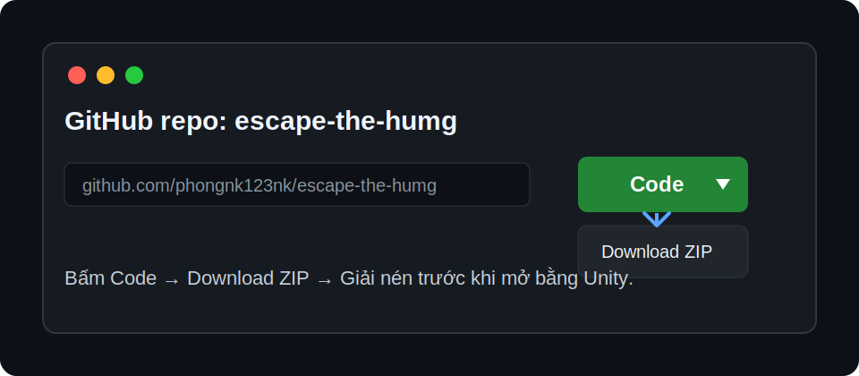
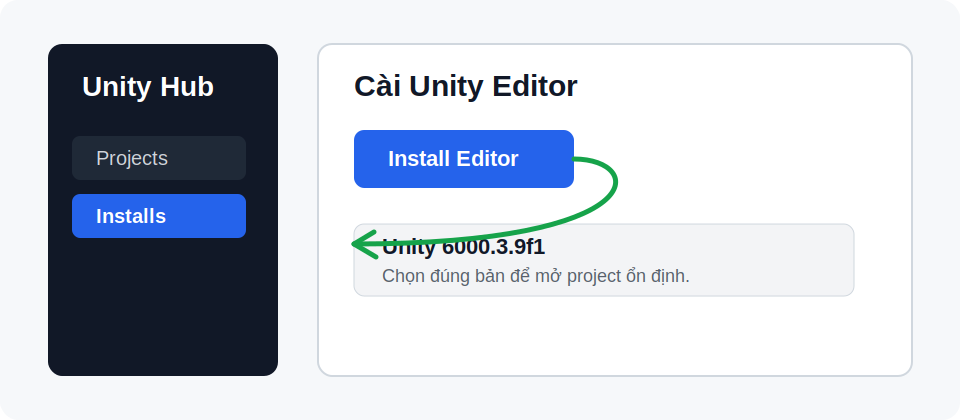
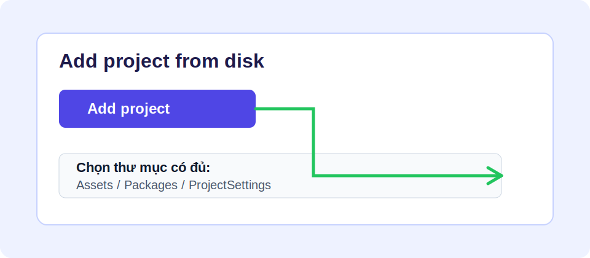
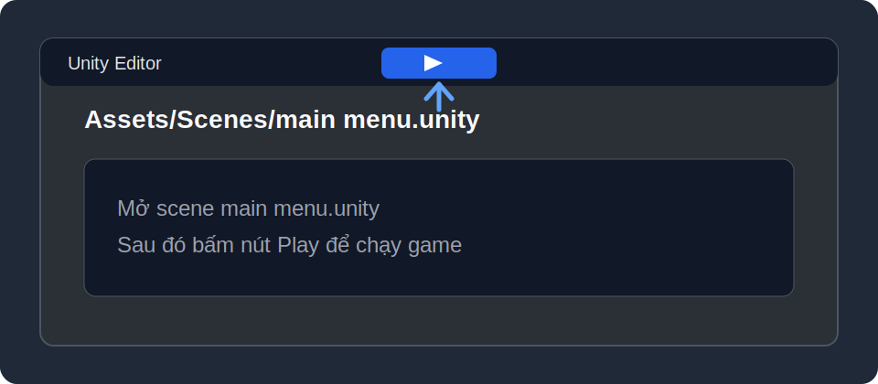
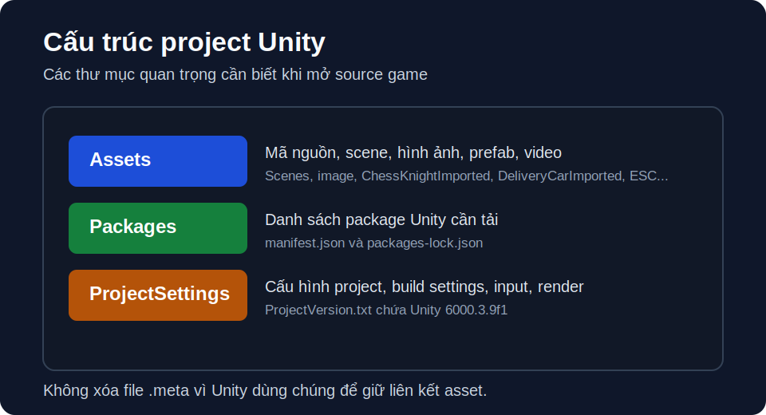

# Escape The HUMG

Đây là project game Unity của **Escape The HUMG**. Repo này đã bao gồm mã nguồn, scene, script, hình ảnh, video nhỏ, prefab, package và toàn bộ file `.meta` cần thiết để tải về mở lại trong Unity.



## 1. Cần cài những gì?

Trước khi mở project, máy cần có:

- **Windows 10 hoặc Windows 11**
- **Unity Hub**
- **Unity Editor 6000.3.9f1**
- Internet trong lần mở đầu tiên để Unity tải package theo file `Packages/manifest.json`

Project này được tạo bằng đúng phiên bản:

```text
Unity 6000.3.9f1
```

Nên dùng đúng bản này để tránh lỗi package, lỗi scene, lỗi render hoặc Unity tự nâng cấp project.

## 2. Cài Unity đúng phiên bản



Làm theo các bước sau:

1. Mở **Unity Hub**.
2. Vào tab **Installs**.
3. Bấm **Install Editor**.
4. Tìm và cài **Unity 6000.3.9f1**.
5. Nếu Unity Hub không hiện đúng bản này, hãy vào **Unity Download Archive**, tìm `6000.3.9f1`, rồi bấm **Install with Unity Hub**.

Khi cài module, nếu chỉ mở project và bấm Play trong Editor thì không cần cài thêm gì đặc biệt. Nếu muốn build game cho người khác chơi, nên cài thêm:

- **Windows Build Support (IL2CPP)** nếu muốn build file `.exe`
- **WebGL Build Support** nếu muốn build bản chơi trên trình duyệt

## 3. Tải project từ GitHub

Link repo:

```text
https://github.com/phongnk123nk/escape-the-humg
```

Cách tải:

1. Mở link repo trên GitHub.
2. Bấm nút **Code** màu xanh.
3. Chọn **Download ZIP**.
4. Giải nén file ZIP ra một thư mục dễ tìm, ví dụ:

```text
D:\UnityProjects\escape-the-humg
```

Không mở project trực tiếp trong file ZIP. Bắt buộc phải giải nén trước.

## 4. Mở project bằng Unity Hub



Làm như sau:

1. Mở **Unity Hub**.
2. Bấm **Add** hoặc **Add project from disk**.
3. Chọn thư mục project đã giải nén.
4. Chọn đúng thư mục có các folder sau:

```text
Assets
Packages
ProjectSettings
```

5. Bấm **Open**.
6. Chờ Unity import toàn bộ asset.

Lần đầu mở project sẽ hơi lâu vì Unity phải tự tạo lại thư mục `Library`.

## 5. Chạy game trong Unity



Sau khi Unity import xong:

1. Trong cửa sổ **Project**, mở thư mục:

```text
Assets/Scenes
```

2. Mở scene:

```text
main menu.unity
```

3. Bấm nút **Play** ở phía trên Unity.

Scene đầu tiên của game là:

```text
Assets/Scenes/main menu.unity
```

## 6. Danh sách scene trong Build Settings

Project hiện có các scene chính sau:

```text
Assets/Scenes/main menu.unity
Assets/Scenes/room1.unity
Assets/Scenes/GOODENDING.unity
Assets/Scenes/BangXepHinh.unity
Assets/Scenes/hanh lang 1.unity
Assets/Scenes/PhongThiNghiem.unity
Assets/Scenes/hanh lang 2.unity
Assets/Scenes/PhongTinHoc.unity
Assets/Scenes/hanh lang 3.unity
Assets/Scenes/ending 1.unity
```

Nếu build game, hãy đảm bảo `main menu.unity` đứng đầu danh sách scene.

## 7. Cấu trúc file trong project



Các phần quan trọng của project nằm ở những vị trí sau:

```text
escape-the-humg/
├── Assets/              Mã nguồn, scene, hình ảnh, prefab, audio, video của game
├── Packages/            Danh sách package Unity cần dùng
├── ProjectSettings/     Cấu hình project Unity
├── docs/images/         Ảnh minh họa dùng trong README
├── README.md            Hướng dẫn tải, mở, chạy và tìm file trong project
└── .gitignore           Danh sách file/thư mục không đưa lên GitHub
```

### Scene của game

Tất cả scene chính nằm trong:

```text
Assets/Scenes
```

Một số scene quan trọng:

```text
Assets/Scenes/main menu.unity          Màn hình menu chính
Assets/Scenes/room1.unity              Scene phòng/màn đầu
Assets/Scenes/hanh lang 1.unity        Hành lang 1
Assets/Scenes/hanh lang 2.unity        Hành lang 2
Assets/Scenes/hanh lang 3.unity        Hành lang 3
Assets/Scenes/PhongThiNghiem.unity     Phòng thí nghiệm
Assets/Scenes/PhongTinHoc.unity        Phòng tin học
Assets/Scenes/BangXepHinh.unity        Màn/bảng xếp hình
Assets/Scenes/GOODENDING.unity         Good ending
Assets/Scenes/ending 1.unity           Ending khác
```

Khi muốn chạy game từ đầu, mở scene:

```text
Assets/Scenes/main menu.unity
```

### Mã nguồn chính

Các script gameplay chính nằm trực tiếp trong:

```text
Assets
```

Một số file mã nguồn quan trọng:

```text
Assets/MainMenuButtonActions.cs                 Xử lý nút ở menu chính
Assets/HallwayImageNavigator.cs                 Điều hướng các màn hành lang
Assets/HallwayArrowHotspot.cs                   Xử lý vùng bấm/mũi tên ở hành lang
Assets/ComputerRoomNavigator.cs                 Điều hướng và logic phòng tin học
Assets/ComputerRoomHotspot.cs                   Vùng tương tác trong phòng tin học
Assets/ComputerRoomMiniGameIcon.cs              Icon mở mini-game trong phòng tin học
Assets/ComputerRoomDoorLockPuzzleTrigger.cs     Logic mở câu đố khóa cửa
Assets/LabSceneNavigator.cs                     Điều hướng phòng thí nghiệm
Assets/LabInventorySystem.cs                    Hệ thống kéo/thả đồ trong phòng thí nghiệm
Assets/LabEquationPuzzleManager.cs              Câu đố phương trình trong phòng thí nghiệm
Assets/InventoryDragItem.cs                     Vật phẩm kéo thả
Assets/GlobalEscPauseMenu.cs                    Menu tạm dừng toàn cục
Assets/RoomIntroVideoPlayer.cs                  Phát video intro trong phòng
Assets/QuanLyThoai.cs                           Quản lý thoại
Assets/TablePaper.cs                            Logic tờ giấy/bàn
```

### Mã nguồn mini-game

Mini-game quân mã nằm ở:

```text
Assets/ChessKnightImported/Scripts
```

Các file chính:

```text
Assets/ChessKnightImported/Scripts/BoardManager.cs
Assets/ChessKnightImported/Scripts/GameManager.cs
Assets/ChessKnightImported/Scripts/Knight.cs
Assets/ChessKnightImported/Scripts/Tile.cs
Assets/ChessKnightImported/Scripts/BoardTheme.cs
```

Mini-game giao hàng/xe nằm ở:

```text
Assets/DeliveryCarImported
```

Một số script liên quan:

```text
Assets/DeliveryOrderMiniGameManager.cs
Assets/DeliveryOrderCarTrigger.cs
Assets/DeliveryCarPlayAreaLimiter.cs
Assets/DeliveryPlayableAreaVisual.cs
Assets/DeliveryCarImported/Scenes/Driver.cs
Assets/DeliveryCarImported/Scenes/CameraTracking.cs
Assets/DeliveryCarImported/Scenes/collision.cs
```

Màn xếp hình/logo nằm ở:

```text
Assets/scr logo1
```

Một số file chính:

```text
Assets/scr logo1/QuanLyXepHinh.cs
Assets/scr logo1/ManhGhepPuzzle.cs
Assets/scr logo1/LogoMorphController.cs
Assets/scr logo1/LogoMorphTrigger.cs
Assets/scr logo1/MoLogoBang.cs
Assets/scr logo1/BamLogoBang.cs
```

Menu ESC/pause nằm ở:

```text
Assets/ESC/Scripts
```

Các script chính:

```text
Assets/ESC/Scripts/PauseMenu.cs
Assets/ESC/Scripts/UIResizer.cs
```

### Tài nguyên game

Hình ảnh chính của game nằm nhiều trong:

```text
Assets/image
```

Một số thư mục hình ảnh quan trọng:

```text
Assets/image/hanh lang 1
Assets/image/hanh lang 2
Assets/image/hanh lang 3
Assets/image/PhongTinHoc
Assets/image/phong thi nghiem
Assets/image/màn 1
Assets/image/fig anh
```

Ảnh và tài nguyên riêng của menu ESC/good ending:

```text
Assets/ESC/Sprites
```

Sprite phụ:

```text
Assets/Sprites
```

Video/audio được đặt ở:

```text
Assets/clip
Assets/StreamingAssets
Assets/image/videos
```

### Prefab, theme và asset phụ

Prefab và asset của mini-game quân mã nằm ở:

```text
Assets/ChessKnightImported/Prefabs
Assets/ChessKnightImported/asset
```

Tài nguyên của mini-game giao hàng nằm ở:

```text
Assets/DeliveryCarImported/Delivery Driver Assets
```

TextMesh Pro và UI Toolkit là tài nguyên Unity dùng cho chữ và giao diện:

```text
Assets/TextMesh Pro
Assets/UI Toolkit
```

### Script Editor

Các script trong thư mục này chỉ chạy trong Unity Editor, dùng để setup hoặc import scene:

```text
Assets/Editor
```

Ví dụ:

```text
Assets/Editor/ComputerRoomSceneSetup.cs
Assets/Editor/HallwaySceneSetup.cs
Assets/Editor/Hallway2SceneSetup.cs
Assets/Editor/DeliveryCarSceneImporter.cs
```

### Package và cấu hình project

Danh sách package Unity:

```text
Packages/manifest.json
Packages/packages-lock.json
```

Cấu hình project:

```text
ProjectSettings
```

Trong đó có version Unity:

```text
ProjectSettings/ProjectVersion.txt
```

### Lưu ý về file `.meta`

Mỗi asset trong Unity thường có một file `.meta` đi kèm. Ví dụ:

```text
Assets/image/menu.png
Assets/image/menu.png.meta
```

Không được xóa file `.meta`, vì Unity dùng chúng để giữ liên kết giữa scene, prefab, sprite, script và tài nguyên.

## 8. Các thư mục không có trong GitHub

Một số thư mục Unity tự sinh ra nên không cần đưa lên GitHub:

```text
Library
Temp
Logs
UserSettings
.plastic
```

Khi tải project về và mở bằng Unity, Unity sẽ tự tạo lại các thư mục này.

## 9. Lỗi thường gặp

### Unity báo sai phiên bản

Hãy cài đúng bản:

```text
Unity 6000.3.9f1
```

Nếu dùng bản Unity khác, Unity có thể tự nâng cấp project và làm thay đổi file setting.

### Mở project bị mất hình, mất sprite, mất prefab

Nguyên nhân thường là thiếu file `.meta`.

Khi tải project về, không được xóa các file `.meta` trong thư mục `Assets`.

### Unity import rất lâu

Đây là bình thường trong lần mở đầu tiên. Unity đang tạo lại thư mục `Library`.

### Project báo lỗi package

Thử làm theo thứ tự:

1. Đóng Unity.
2. Mở lại project bằng Unity Hub.
3. Kiểm tra máy có Internet.
4. Nếu vẫn lỗi, xóa thư mục `Library`, sau đó mở lại project.

## 10. Build game ra file cho người khác chơi

Nếu chỉ gửi source code thì người nhận cần cài Unity. Nếu muốn người khác chỉ tải về và chơi luôn, hãy build ra bản Windows.

Cách build:

1. Mở Unity.
2. Vào **File > Build Profiles** hoặc **File > Build Settings**.
3. Chọn platform **Windows**.
4. Kiểm tra scene đầu tiên là:

```text
Assets/Scenes/main menu.unity
```

5. Bấm **Build**.
6. Chọn thư mục output, ví dụ:

```text
Builds/Windows
```

7. Sau khi build xong, nén cả thư mục build thành file `.zip`.
8. Gửi file `.zip` đó cho người khác.

Người chơi chỉ cần giải nén và chạy file `.exe`, không cần cài Unity.

## 11. Clone bằng Git

Nếu không tải ZIP mà dùng Git, chạy lệnh:

```bash
git clone https://github.com/phongnk123nk/escape-the-humg.git
```

Sau đó mở thư mục vừa clone bằng Unity Hub.

## 12. Ghi chú

- Không xóa file `.meta`.
- Không cần tải hoặc copy thư mục `Library`.
- Nên mở bằng Unity `6000.3.9f1`.
- Lần đầu mở project có thể mất vài phút để Unity import lại toàn bộ dữ liệu.
